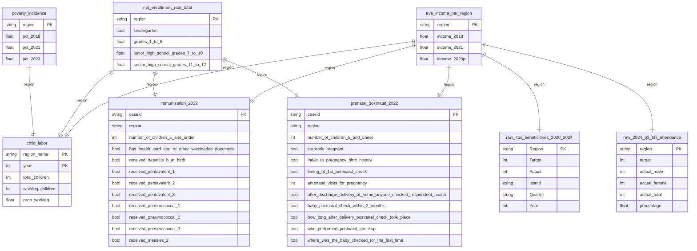

```mermaid
erDiagram

    poverty_incidence {
        string region PK
        float pct_2018
        float pct_2021
        float pct_2023
    }

    net_enrollment_rate_total {
        string region PK
        float kindergarten
        float grades_1_to_6
        float junior_high_school_grades_7_to_10
        float senior_high_school_grades_11_to_12
    }

    ave_income_per_region {
        string region PK
        float income_2018
        float income_2021
        float income_2023p
    }

    child_labor {
        string region_name PK
        int year PK
        int total_children
        int working_children
        float prop_working
    }

    immunization_2022 {
        string caseid PK
        string region
        int number_of_children_5_and_under
        bool has_health_card_and_or_other_vaccination_document
        bool received_hepatitis_b_at_birth
        bool received_pentavalent_1
        bool received_pentavalent_2
        bool received_pentavalent_3
        bool received_pneumococcal_1
        bool received_pneumococcal_2
        bool received_pneumococcal_3
        bool received_measles_2
    }

    prenatal_postnatal_2022 {
        string caseid PK
        string region
        int number_of_children_5_and_under
        bool currently_pregnant
        bool index_to_pregnancy_birth_history
        bool timing_of_1st_antenatal_check
        int antenatal_visits_for_pregnancy
        bool after_discharge_delivery_at_home_anyone_checked_respondent_health
        bool baby_postnatal_check_within_2_months
        bool how_long_after_delivery_postnatal_check_took_place
        bool who_performed_postnatal_checkup
        bool where_was_the_baby_checked_for_the_first_time
    }

    raw_4ps_beneficiaries_2020_2024 {
        string Region PK
        int Target
        int Actual
        string Island
        string Quarter
        int Year
    }

    raw_2024_q3_fds_attendance {
        string region PK
        int target
        int actual_male
        int actual_female
        int actual_total
        float percentage
    }

    %% RELATIONSHIPS
    poverty_incidence ||--|| child_labor : region
    net_enrollment_rate_total ||--|| child_labor : region
    ave_income_per_region ||--|| child_labor : region

    net_enrollment_rate_total ||--|| immunization_2022 : region
    ave_income_per_region ||--|| immunization_2022 : region

    net_enrollment_rate_total ||--|| prenatal_postnatal_2022 : region
    ave_income_per_region ||--|| prenatal_postnatal_2022 : region

    ave_income_per_region ||--|| raw_4ps_beneficiaries_2020_2024 : region
    ave_income_per_region ||--|| raw_2024_q3_fds_attendance : region
```
