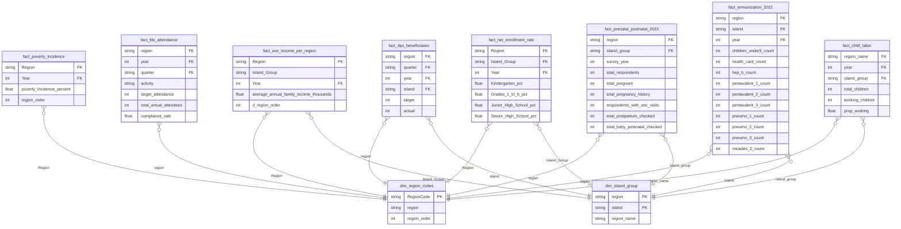

```mermaid
erDiagram

    dim_region_codes {
        string RegionCode PK
        string region
        int region_order
    }

    dim_island_group {
        string region PK
        string island PK
        string region_name
    }

    fact_poverty_incidence {
        string Region FK
        int Year FK
        float poverty_incidence_percent
        int region_order
    }

    fact_ave_income_per_region {
        string Region FK
        string Island_Group
        int Year FK
        float average_annual_family_income_thousands
        int d_region_order
    }

    fact_4ps_beneficiaries {
        string region FK
        string quarter FK
        int year FK
        string island FK
        int target
        int actual
    }

    fact_fds_attendance {
        string region FK
        int year FK
        string quarter FK
        string activity
        int target_attendance
        int total_actual_attendees
        float compliance_rate
    }

    fact_net_enrollment_rate {
        string Region FK
        string Island_Group FK
        int Year FK
        float Kindergarten_pct
        float Grades_1_to_6_pct
        float Junior_High_School_pct
        float Senior_High_School_pct
    }

    fact_prenatal_postnatal_2022 {
        string region FK
        string island_group FK
        int survey_year
        int total_respondents
        int total_pregnant
        int total_pregnancy_history
        int respondents_with_anc_visits
        int total_postpartum_checked
        int total_baby_postnatal_checked
    }

    fact_immunization_2022 {
        string region FK
        string island FK
        int year FK
        int children_under5_count
        int health_card_count
        int hep_b_count
        int pentavalent_1_count
        int pentavalent_2_count
        int pentavalent_3_count
        int pneumo_1_count
        int pneumo_2_count
        int pneumo_3_count
        int measles_2_count
    }

    fact_child_labor {
        string region_name FK
        int year FK
        string island_group FK
        int total_children
        int working_children
        float prop_working
    }

    %% =======================
    %% RELATIONSHIPS
    %% =======================

    fact_poverty_incidence }o--|| dim_region_codes : "Region"
    fact_ave_income_per_region }o--|| dim_region_codes : "Region"
    fact_4ps_beneficiaries }o--|| dim_region_codes : "region"
    fact_fds_attendance }o--|| dim_region_codes : "region"
    fact_net_enrollment_rate }o--|| dim_region_codes : "Region"
    fact_prenatal_postnatal_2022 }o--|| dim_region_codes : "region"
    fact_immunization_2022 }o--|| dim_region_codes : "region"
    fact_child_labor }o--|| dim_region_codes : "region_name"

    fact_ave_income_per_region }o--|| dim_island_group : "Island_Group"
    fact_4ps_beneficiaries }o--|| dim_island_group : "island"
    fact_net_enrollment_rate }o--|| dim_island_group : "Island_Group"
    fact_prenatal_postnatal_2022 }o--|| dim_island_group : "island_group"
    fact_immunization_2022 }o--|| dim_island_group : "island"
    fact_child_labor }o--|| dim_island_group : "island_group"
```
