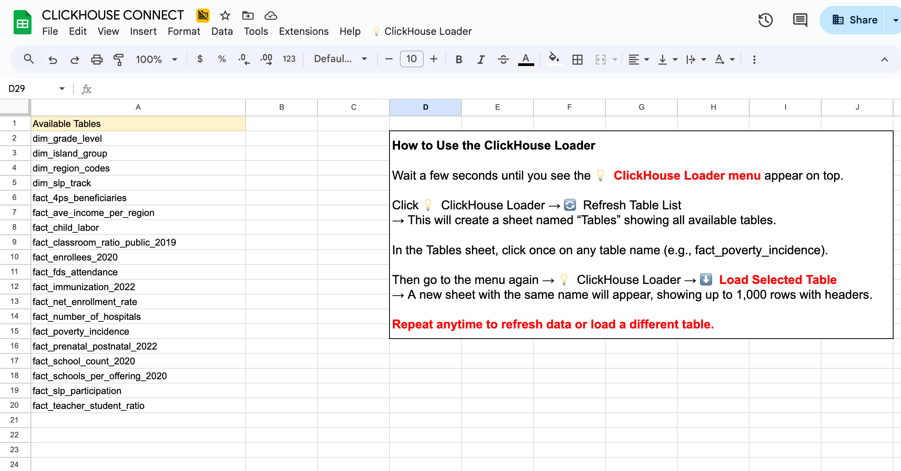
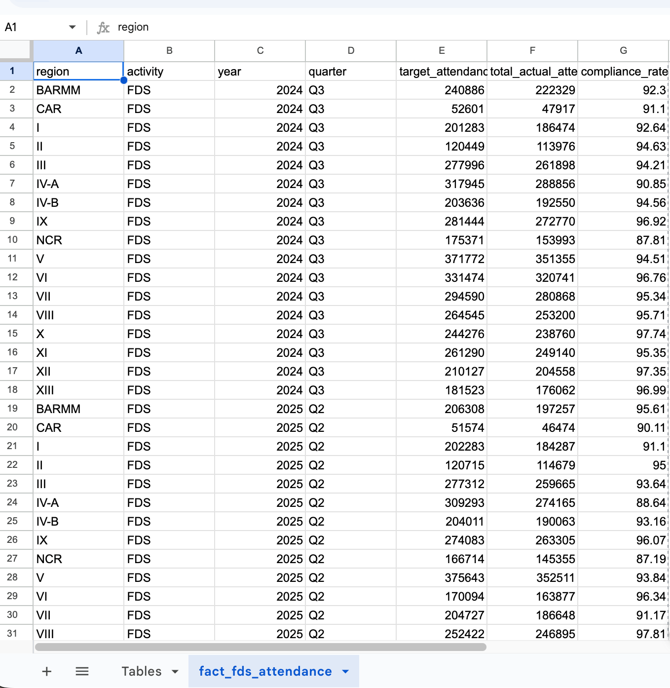

# Connecting ClickHouse to Google Sheets

## Overview

The team primarily uses **Google Sheets** to access FTW ClickHouse datasets, rather than Tableau. This approach allows lightweight exploration and automated reporting while overcoming limitations in Tableau (e.g., no editable matrices, fixed scatterplot axes). Using **Apps Script**, analysts can pull data directly into Sheets and perform regional performance and success measurement via **matrix-style tables** in XLSX format, which Tableau cannot fully support.

---

## Why Google Sheets / Apps Script

- Analysts can **directly fetch tables** from ClickHouse into Sheets.
- Supports **automated updates** via scripts, avoiding manual CSV downloads.
- Enables **matrix presentation** of regional indicators (Education, Health, Child Labor, Community Participation), which is difficult in Tableau.
- Lightweight and collaborative: multiple users can explore the data without Tableau licenses.

---

## Setup

1. Open any Google Sheet.
2. Go to **Extensions → Apps Script**.
3. Paste your ClickHouse Apps Script below:

```javascript
const CLICKHOUSE_HOST = "54.87.106.52";
const CLICKHOUSE_USER = "ftw_grp4";
const CLICKHOUSE_PASS = "Pika@025!FTW";
const DATABASE = "mart_grp4";

// ====== MENU SETUP ======
function onOpen() {
  var ui = SpreadsheetApp.getUi();
  ui.createMenu("💡 ClickHouse Loader")
    .addItem("🔄 Refresh Table List", "listMartTables")
    .addItem("⬇️ Load Selected Table", "loadSelectedTable")
    .addToUi();
}

// ====== LIST TABLES ======
function listMartTables() {
  var query = "SHOW TABLES FROM " + DATABASE;
  var data = runClickHouseQuery(query, "\t");
  var ss = SpreadsheetApp.getActiveSpreadsheet();
  var sheet = ss.getSheetByName("Tables") || ss.insertSheet("Tables");
  sheet.clearContents();
  sheet.getRange(1,1).setValue("Available Tables");
  if(data && data.length) {
    var rows = data.map(r => [r[0]]);
    sheet.getRange(2,1,rows.length,1).setValues(rows);
  }
}

// ====== LOAD SELECTED TABLE ======
function loadSelectedTable() {
  var ss = SpreadsheetApp.getActiveSpreadsheet();
  var tableSheet = ss.getSheetByName("Tables");
  var selectedTable = tableSheet.getActiveCell().getValue();
  var query = "SELECT * FROM " + DATABASE + "." + selectedTable + " LIMIT 1000 FORMAT CSVWithNames";
  var data = runClickHouseQuery(query, ",");
  var output = ss.getSheetByName(selectedTable) || ss.insertSheet(selectedTable);
  output.clearContents();
  if(data && data.length) {
    output.getRange(1,1,data.length,data[0].length).setValues(data);
  }
}

// ====== QUERY HELPER ======
function runClickHouseQuery(query, delimiter) {
  var url = "http://" + CLICKHOUSE_HOST + ":8123/?query=" + encodeURIComponent(query);
  var headers = {"Authorization": "Basic " + Utilities.base64Encode(CLICKHOUSE_USER + ":" + CLICKHOUSE_PASS)};
  var response = UrlFetchApp.fetch(url, {method:"get", headers:headers, muteHttpExceptions:true});
  return Utilities.parseCsv(response.getContentText().trim(), delimiter);
}
```
# How to Use ClickHouse Google Sheets Loader

This section explains how to use the Google Sheets Apps Script to fetch tables from the FTW ClickHouse server.



## Steps

### Step 1: Refresh Table List
1. Open the Google Sheet with the Apps Script installed.
2. Go to **Extensions → 💡 ClickHouse Loader → 🔄 Refresh Table List**.
3. A new sheet named `Tables` will appear with a list of all available tables.

### Step 2: Select a Table
1. In the `Tables` sheet, click the **cell containing the table name** you want to load.

### Step 3: Load the Table
1. Go to **Extensions → 💡 ClickHouse Loader → ⬇️ Load Selected Table**.
2. A new sheet with the selected table’s name will appear.
3. The **first row contains column headers**, and up to 1,000 rows of data are loaded.


---

## Notes
- If you do not see the menu, open **Extensions → Apps Script → Run `onOpen()`**.
- Reloading a table **overwrites the existing sheet**.
- The matrix output in XLSX is useful for measuring regional performance, which cannot be done in Tableau (scatterplot only, no editable axes).


